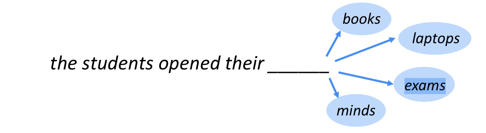
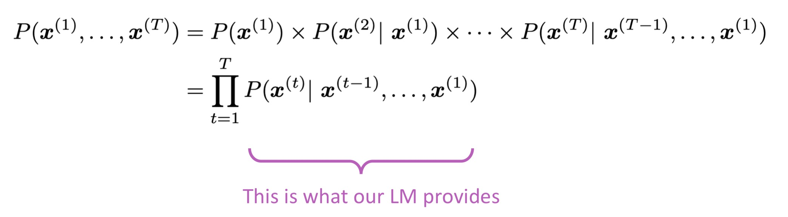
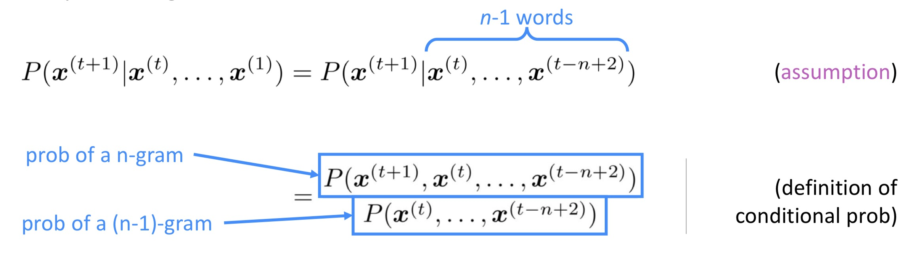
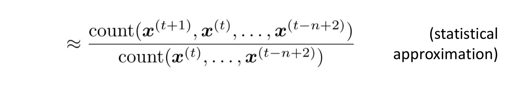
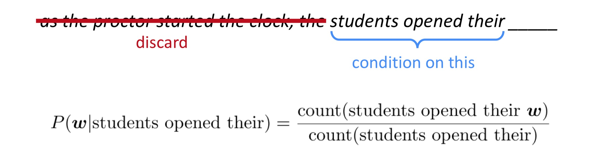
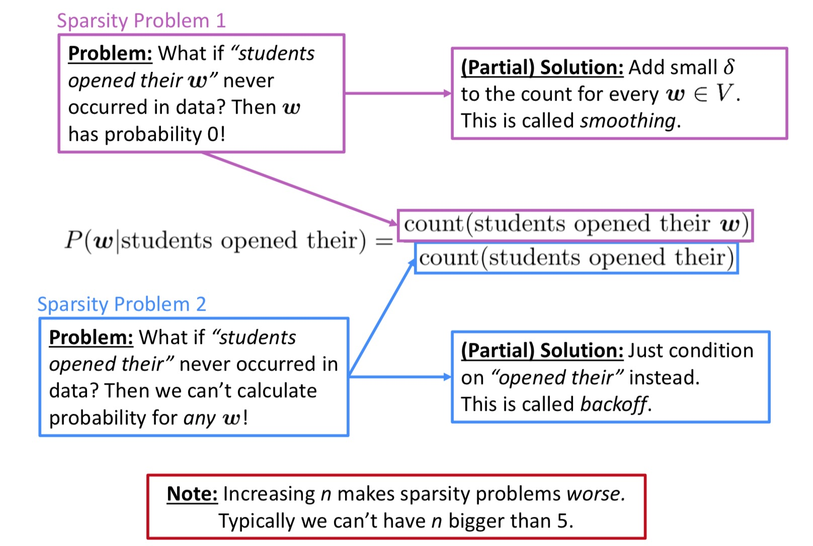
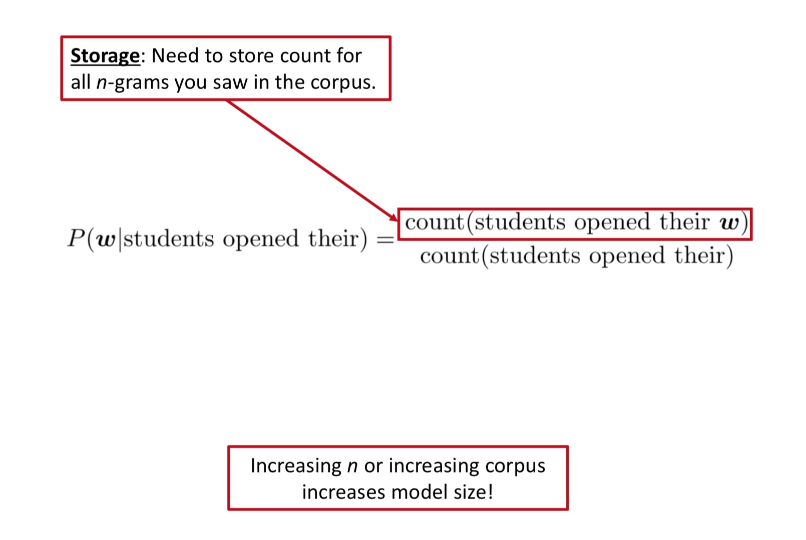

[TOC]
# Language Model

## The concept of LM
* Languange Modeling is the task of predicting what word comes next.

 
* More formally: given a sequence of words $x^{(1)},x^{(2)},...,x^{(t)}$, compute the probability distribution of the next word $x^{(t+1)}$:
$$P(x^{(t+1)}|x^{(t)},...,x^{(1)})$$
where $x^{(t+1)}$ can be any word in the vocabulary $V = \{w_1,...,w_{|V|}\}$
 
* A system that dose this is called a Language Model.
 
* You can also think of a Language Model as a system that assigns probability to a piece of text.
For example, if we have some text $x^{(1)},...,x^{(T)}$, then the probability of this text (according to the Language Model) is:

综上，语言模型（Language Model, LM）有两个最显著的特征：
1. 给定一段文本，预测接下来一个字或词的概率（生成特性）;
2. 由第一个特性，结合链式法则，可以用来判断一段完整文本出现的概率（判别特性）;

这两个特征也决定了LM的多个应用场景，如

## preprocess of data

## n-gram Language Models

### notation

 the students opened their ___________ 

* Question: How to learn a Language Model?
* Answer(pre- Deep Learning): learn a n-gram Language Model!
* Definition: A n-gram is a chunk of n consecutive words.
    * unigrams: "the", "students", "opened", "their"
    * bigrams: "the students", "students opened", "opened their"
    * trigrams: "the students opened", "students opened their"
    * 4-grams: "the students opened their"
* Idea: Collect statistics about how frequent different n-grams are, and use these to predict next word.

### n-gram model
 
#### assumption
First we make a simplifying assumption: $x^{(t+1)}$ depends only on the preceding n-1 words.

#### n-gram probabilities
* Question: How do we get these n-gram and (n-1)-gram probabilities?
* Answer: By counting them in some large corpus of text!

#### example
Suppose we are learing a 4-gram Language Model.

For example, suppose that in the corpus:
* "students opened their" occurred 1000 times
* "students opened their books" occurred 400 times
    * -> P(books | students opened their) = 0.4
* "students opened their exams" occurred 100 times
    * -> P(exams | students opened their) = 0.1

ps: should we have discarded the "proctor" context?

### Sparsity Problems with n-gram LM model
对于机器学习的问题来讲，数据的稀疏性往往是比较头疼的

#### smoothing algorithm
- [ ] todo
* Laplace Smoothing

* Add-k smoothing

* Kneser-Ney Smoothing
#### backoff and interpolation
- [ ] todo

### Storage Problems with n-gram LM model
基于n-gram的LM model

## Evaluating Language Models

### extrinsic evaluation
The best way to evaluate the performance of a language model is to embed it in an application and measure how much the application improves. Such end-to-end evaluation is called extrinsic evaluation. Extrinsic evaluation is the only way to know if a particular improvement in a component is really going to help the task at hand.
外部评价：用本任务对下游任务或者整体任务的提升贡献来评价本任务的效果；评测效果准确，有说服力，但是代价较高；

### intrinsic evaluation
An intrinsic evaluation metric is one that mea- sures the quality of a model independent of any application.
* test set
* evaluation metric
目前，绝大多数的机器学习任务都是采用intrinsic的评估方式。

### Perplexity
$$PP(W) = P(w_1w_2...w_N)^{-\frac{1}{N}} = \sqrt[N]{\frac{1}{P(w_1w_2...w_N)}}$$
We can use the chain rule to expand the probability of W:
$$PP(W) = \sqrt[N]{\prod_{i=1}^{N}\frac{1}{P(w_1w_2...w_N)}}$$

## Unknown Words(集外词)

